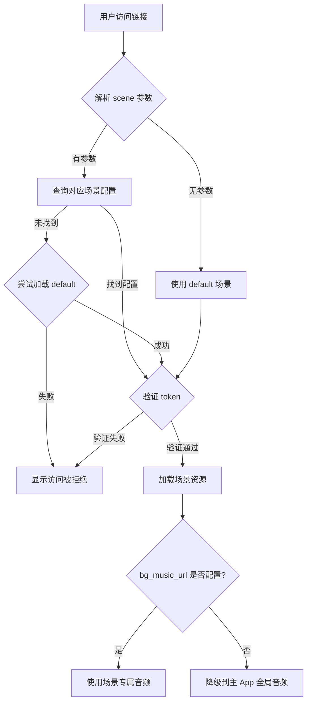

# 多场景配置系统使用指南

## 概述

本系统已全面升级为支持多场景配置的架构，允许您为不同的引流场景创建独立的音频、背景和访问令牌配置。

---

## 核心功能

### 1. 多场景支持
- **场景标识（scene_token）**: 每个场景的唯一标识符（如 `zen2026`、`morning`、`healing`）
- **场景名称（scene_name）**: 场景的显示名称（如 "禅意疗愈"、"晨间唤醒"）
- **独立配置**: 每个场景可以有独立的音频、背景视频、访问令牌

### 2. 格式支持
系统已彻底放开格式限制，现支持：
- **图片格式**: `.jpg`、`.png`、`.webp`
- **音频格式**: `.mp3`（推荐 192kbps 高品质）
- **视频格式**: `.mp4`

### 3. 音频加载优先级（三级策略）

```
优先级 1: 场景专属音频 (h5_share_config.bg_music_url)
    ↓ 如果未配置
优先级 2: 主 App 全局音频 (audio_files 表)
    ↓ 如果未配置
优先级 3: 本地静态资源（未实现）
```

---

## 使用步骤

### 步骤 1: 访问管理后台

访问 `/admin/share-config` 并使用密码登录：
- 密码: `plantlogic2026`

### 步骤 2: 创建新场景

1. 点击 **"新增场景配置"** 按钮
2. 填写必填字段：
   - **场景标识 (scene_token)**: 唯一标识符，如 `morning`、`healing`
   - **场景名称 (scene_name)**: 显示名称，如 "晨间唤醒"
   - **访问令牌 (daily_token)**: 用于验证访问权限，如 `morning2026`

3. 配置场景资源：
   - **背景音乐 URL**: 点击"选择 MP3 文件上传"或手动输入 URL
   - **背景视频 URL**: 输入 .mp4 视频 URL
   - **卡片背景图**: 支持 .jpg / .png / .webp
   - **卡片内部背景**: 支持 .jpg / .png / .webp

4. （可选）配置各步骤专属背景：
   - 起名页背景
   - 情绪页背景
   - 日记页背景
   - 过渡页背景
   - 答案之书背景

5. 点击 **"保存配置"** 按钮

### 步骤 3: 获取专属链接

保存成功后，点击场景卡片上的 **"复制链接"** 按钮，自动复制专属链接：

```
https://your-domain.com/share/journal?scene=morning&token=morning2026
```

---

## 场景访问逻辑

### URL 结构

```
/share/journal?scene={场景标识}&token={访问令牌}
```

**参数说明**:
- `scene`: 场景标识（scene_token），如果不提供则默认使用 `default`
- `token`: 访问令牌（daily_token），必须匹配该场景配置的令牌

### 访问验证流程



---

## 音频上传指南

### 推荐规格
- **格式**: MP3
- **比特率**: 192kbps（高品质）
- **最大文件大小**: 100MB
- **时长**: 建议 10-30 分钟（用于冥想/疗愈场景）

### 上传方式

#### 方式 1: 通过管理后台上传
1. 在场景配置页面，找到"背景音乐 URL"部分
2. 点击 **"选择 MP3 文件上传"** 按钮
3. 选择本地 MP3 文件
4. 等待上传完成（显示进度条）
5. URL 自动填充到输入框

#### 方式 2: 手动输入 URL
如果您的音频已上传到 CDN，可以直接输入 URL：
```
https://your-cdn.com/music/morning-meditation.mp3
```

### 音频性能优化

系统已内置以下优化：
- **流式播放**: 使用 HTTP Range Requests，无需等待完整下载
- **秒开播放**: 仅预加载元数据，1-2 秒内开始播放
- **自动循环**: 音频自动循环播放，无缝衔接
- **内存管理**: 自动清理未使用的音频资源

---

## 场景管理

### 编辑现有场景
1. 在管理后台左侧场景列表中，点击要编辑的场景
2. 修改配置字段
3. 点击"保存配置"

### 删除场景
1. 点击场景卡片上的 **删除图标**（垃圾桶）
2. 确认删除操作
3. **注意**: 默认场景（default）不能删除

### 激活/停用场景
- 使用 **"启用此场景"** 开关控制场景的激活状态
- 停用的场景无法访问（返回"访问被拒绝"）

---

## 数据库结构

### h5_share_config 表

| 字段名 | 类型 | 说明 | 必填 |
|--------|------|------|------|
| id | uuid | 主键 | 自动生成 |
| scene_token | text | 场景标识（唯一） | 是 |
| scene_name | text | 场景名称 | 是 |
| description | text | 场景描述 | 否 |
| is_active | boolean | 是否激活 | 是（默认 true） |
| daily_token | text | 访问令牌 | 是 |
| bg_music_url | text | 背景音乐 URL | 否 |
| bg_video_url | text | 背景视频 URL | 否 |
| card_bg_image_url | text | 卡片背景图 URL | 否 |
| card_inner_bg_url | text | 卡片内部背景 URL | 否 |
| bg_naming_url | text | 起名页背景 URL | 否 |
| bg_emotion_url | text | 情绪页背景 URL | 否 |
| bg_journal_url | text | 日记页背景 URL | 否 |
| bg_transition_url | text | 过渡页背景 URL | 否 |
| bg_answer_book_url | text | 答案之书背景 URL | 否 |
| created_at | timestamptz | 创建时间 | 自动生成 |
| updated_at | timestamptz | 更新时间 | 自动更新 |

### 唯一索引
- `idx_h5_share_config_scene_token` (UNIQUE) - 确保每个场景标识唯一

---

## 常见问题

### Q1: 创建新场景后无法保存？
**A**: 检查以下几点：
1. scene_token 是否已存在（必须唯一）
2. scene_name 和 daily_token 是否已填写（必填字段）
3. 是否已登录管理后台

### Q2: 音频没有播放？
**A**: 查看浏览器控制台日志：
1. 检查"场景配置已加载"日志，确认 bg_music_url 是否正确
2. 如果 bg_music_url 为空，系统会自动降级到主 App 全局音频
3. 确认音频 URL 可访问且格式正确

### Q3: 如何为不同场景配置不同音乐？
**A**: 为每个场景上传独立的 MP3 文件：
```
场景 A (zen2026):    上传 zen-meditation.mp3
场景 B (morning):    上传 morning-energy.mp3
场景 C (healing):    上传 healing-sound.mp3
```

### Q4: 可以删除默认场景吗？
**A**: 不可以。默认场景（scene_token='default'）作为备用场景，不能删除。

### Q5: 支持哪些图片格式？
**A**: 系统已彻底放开格式限制，支持：
- `.jpg` - JPEG 格式
- `.png` - PNG 格式（支持透明）
- `.webp` - WebP 格式（推荐，文件更小）

---

## 技术特性

### 安全性
- **RLS（行级安全）**: 只有认证用户可以修改配置
- **公开读取**: 任何人可以读取激活的场景配置
- **Token 验证**: 必须提供正确的 daily_token 才能访问场景

### 性能优化
- **流式音频播放**: 使用 HTTP 206 Partial Content
- **预加载策略**: 仅预加载元数据，按需加载完整音频
- **资源缓存**: 自动缓存音频和视频资源
- **内存清理**: 组件卸载时自动释放音频资源

### 兼容性
- ✅ Chrome/Edge（推荐）
- ✅ Safari（iOS/macOS）
- ✅ 微信内置浏览器
- ✅ 移动端浏览器

---

## 示例配置

### 示例 1: 禅意疗愈场景
```
场景标识: zen2026
场景名称: 禅意疗愈
访问令牌: zen2026
背景音乐: https://cdn.example.com/zen-meditation.mp3 (192kbps, 30分钟)
背景视频: https://cdn.example.com/cosmic-space.mp4
卡片背景: /assets/zen-card-bg.jpg
```

访问链接：
```
https://your-domain.com/share/journal?scene=zen2026&token=zen2026
```

### 示例 2: 晨间唤醒场景
```
场景标识: morning
场景名称: 晨间唤醒
访问令牌: morning2026
背景音乐: https://cdn.example.com/morning-energy.mp3 (192kbps, 15分钟)
背景视频: https://cdn.example.com/sunrise.mp4
卡片背景: /assets/morning-card-bg.png
```

访问链接：
```
https://your-domain.com/share/journal?scene=morning&token=morning2026
```

---

## 总结

✅ **已实现的功能**:
1. 多场景配置支持（无限场景数量）
2. 场景标识唯一性约束
3. 彻底放开图片格式限制（.jpg/.png/.webp）
4. MP3 音频完全支持（192kbps 高品质）
5. 三级音频加载优先级策略
6. 场景专属链接自动生成
7. 音频流式播放优化
8. 完整的场景管理界面

🎯 **使用建议**:
- 为每个引流渠道创建独立场景
- 使用有意义的 scene_token（如 `morning`、`healing`）
- 为每个场景配置专属的 192kbps MP3 音频
- 定期检查音频 URL 是否可访问
- 使用不同的 daily_token 区分访问来源

📞 **技术支持**:
如有问题，请查看浏览器控制台日志，其中包含详细的场景加载和音频播放信息。
